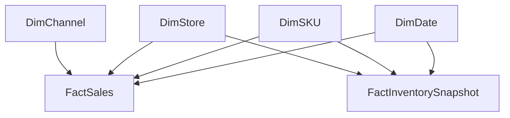

# Semantic Model (Star Schema)

## Fact tables
- FactSales (transaction grain)
- FactInventorySnapshot (daily SKU-store grain)

## Dimension tables
- DimDate
- DimSKU
- DimStore
- DimChannel

## Relationships (single direction, many-to-one)

FactSales
- FactSales[OrderDate] → DimDate[Date]
- FactSales[SKU] → DimSKU[SKU]
- FactSales[Store] → DimStore[Store]
- FactSales[Channel] → DimChannel[Channel]

FactInventorySnapshot
- FactInventorySnapshot[SnapshotDate] → DimDate[Date]
- FactInventorySnapshot[SKU] → DimSKU[SKU]
- FactInventorySnapshot[Store] → DimStore[Store]

## Design rationale
- Star schema to avoid ambiguous filters
- Shared dimensions ensure consistent KPI definitions
- Single-direction filtering for predictable aggregation behavior

## Semantic Model (Star Schema)

